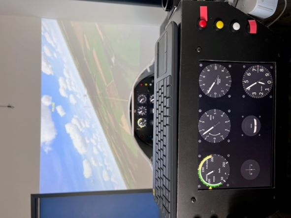

# Condor-simu

Here are the source code files used for [CEVV](http://www.cevv.be) Flight simulator.

The Simulator uses a converted K7 front fuselage as basis.The flight simulator software is Condor Soaring.

# Our simulator

Is a biplace simulator based on an old K-7 cockpit.

![frontview]
![backview]
![inflight]
# Architecture

The software elements present in this git are:
    - The HTML code for the dashboard
    - The Udp2Json glue between *Condor* and the dashboard.
    - Arduino code used for the controlleurs (K7-Joy and the additional controlleur for a POV hat)
    - Kicad schema and circuit board (to be added)

# Dash board

Each seat enjoys a 10" LCD screen (1920x1200) as a dynamic dashboard. Both dashboards are mirros of eah other thanks to an HDMI splitter.

The dashboard is build using the nice G3 (https://github.com/patricksurry/g3) library. An Html/javascript page is loaded in a browser (*Chrome*) set to fill the dashboard screen.
The javascript will fetch the metrics repeatidly from the udp2json program.

The dashboard has three active fields:
1. The dropdown glider selection menu. Changing the glider will adjust the speeds on the HSI
1. the R (reset) button on the G-meter
1. the QFE/QNH toggle on the altimeter.

To use the buttons from *Condor*:

- Pause *Condor* (physical button on the dashboard)
- Switch out of *Condor* using the ALT-TAB key combination
- Switch to *Chrome*
- Move the pointer and click on the desired field (from the PC point of view, the dashboard screen is below the projector)
- Click back in Condor to restore the focus 

The QFE altitude is recorded at the time of the button press. In practice, use the button before the take off run.
# UDP2json

The udp2json program receives the UDP packet send by Condor to a json served by a build in web server.
The software also serve the dashboard html and javascripts.
It can also relay the UDP packets to another consumer.

Full documentation of the udp2json process is in the udp2json folder.

# Arduino code

Two arduino sketches are used:

- the K7-joy sketch implements most joystick functions
- The Hat use a spare controller to a a POV HAT.

Both sketches use the (https://github.com/MHeironimus/ArduinoJoystickLibrary) library.
# Kicad pcbs:

Arduino based controller with

- Arduno Micro Pro
- ADS1115 16bit Analog to Digital converter (16bit)

Hall sensors are set to each axes (pitch, roll, yaw +trim and AF) 
An extra connector is used to detect the release of the Tow cable.

Buttons in the dashboard (8 + a rotating encoder to adjust the vario sound) are connected to the controller using RJ45 cables.
A relay (passive RJ45 to RJ45) in the instructor dashboard synchronize the buttons between both positions.

# Software installation

To achieve a self starting Simulator:

1. Install Condor Soaring
1. Extract the git content to some convenient place
1. Install udp2json as a service. See (UDP2json/README.md)
1. Prepare a Chrome instance
    - Separate profile
    - Started in dashboard screen
    - (http://localhost:8080/dash/Dash.html) as start up page
    - Kiosk mode
1. Set in the windows startup (C:\Users\XXXXX\AppData\Roaming\Microsoft\Windows\Start Menu\Programs\Startup)
    - Chrome with the dashboard profile
    - Condor
1. Adjust joysticks curves
    1. Center each axe
    1. adjust the response curves in *Joystick Curves*
1. Configure the inputs in *Condor*
1. Enjoy the flights
